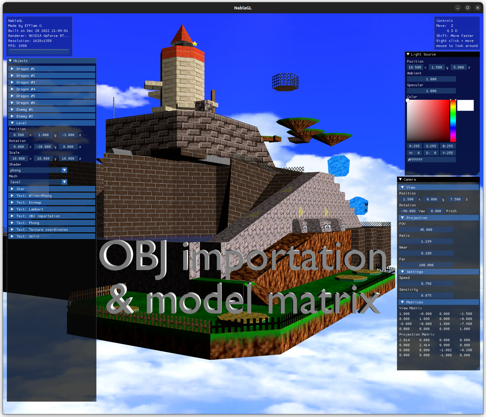
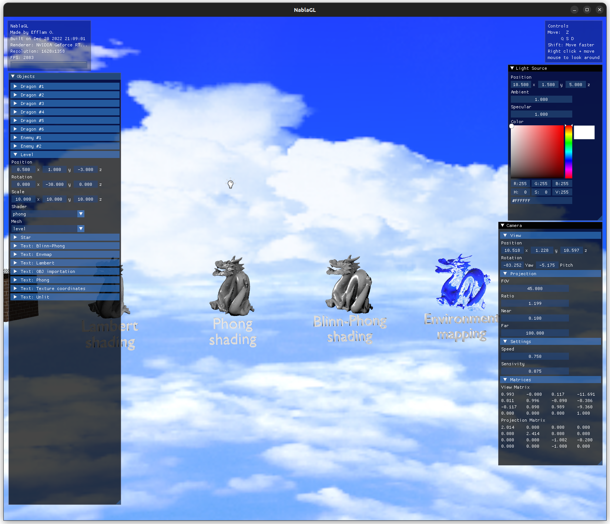
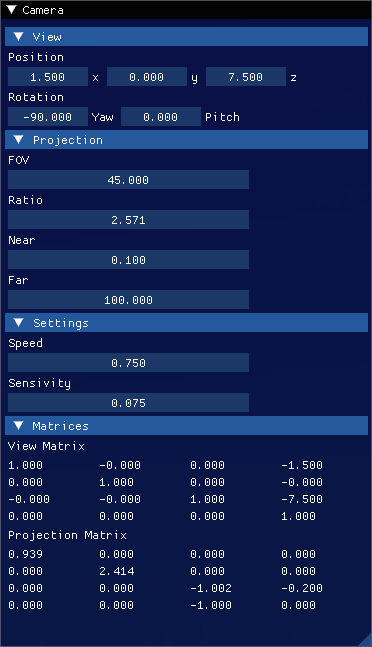
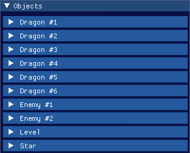
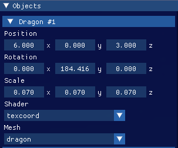
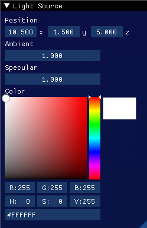

# NablaGL
### 2022 - Efflam O.
#### Computer Graphics - Projet OpenGL - E4FI
  
###  Avertissement
Ce projet a été réalisé dans le cadre d'un projet d'école, il n'est pas destiné à être utilisé en production.
Les assets contenus dans les dossiers `assets\Models` et `assets\Skybox` sont des assets sous copyright (C) Nintendo, ils ne sont fournis qu'à des fins d'exemple.

# Présentation

NablaGL est un prototype de moteur de rendu 3D OpenGL, développé en C++ avec la bibliothèque [GLFW](https://www.glfw.org/).

## Fonctionnalités implémentées
* Plusieurs objets différents (avec position, rotation et taille différente)
* Textures sRGB
* Shaders différents : Unlit, Texcoords, Lambert, Phong, Blinn-Phong et Environment Map
* Support des matériaux : couleur ambiente, diffuse et spéculaire
* Charger des objets OBJ avec tinyobjloader (avec support des matériaux)
* Skybox
* Classe matrice 4x4
* Système modèle, vue, projection
* Caméra paramétrable
* Déplacement dans la scène (ZQSD + souris)
* Lumière omni-directionnelle
* UBO pour la caméra et la lumière
* ImGUI

## Captures d'écran

  
## Fenêtres ImGUI
- Paramètres de la caméra  

- Liste des objets de la scène  

- Paramètres par objet  

  - Le shader et le mesh de l'objet peuvent être changé au runtime
    - Le shader / le mesh n'est qu'une référence à un objet déjà chargé en mémoire, comme ça on peut avoir plusieurs objets utilisant le même mesh/shader, sans avoir à le charger plusieurs fois
- Paramètres de la lumière  

  - Le paramètre `Ambient` correspond au facteur d'intensité ambiente (entre 0 et 5)
  - Le paramètre `Specular` correspond au facteur d'intensité spéculaire (entre 0 et 1)
  - La lumière possède une couleur
  - La position de la lumière est affichée dans la scène par une texture 2D se tournant toujours vers la caméra

# Compilation

## Prérequis
### GNU/Linux (recommandé)
* GCC
* Python 3
* Conan (installable avec `pip install conan`)
* CMake (Ubuntu/Debian: `sudo apt install cmake`)
* OpenGL (Ubuntu/Debian: `sudo apt install libopengl-dev`)
### Windows (non conseillé)
* Visual Studio
* Python 3
* Conan (Installer avec `pip install conan`, assurez vous que le dossier de scripts Python soit dans le PATH)
* [CMake](https://cmake.org/download/)

## Compilation
### Préparatifs
* Créer un répertoire de travail, et entrer dedans
  - `mkdir build && cd build`
* Initialiser conan
  - Linux uniquement: `export CONAN_SYSREQUIRES_MODE=enabled` 
  - `conan install .. --build=missing`
  - Installer les dépendances si Conan le propose
* Initialiser CMake
  - Toujours dans le dossier build, lancer `cmake ..`

### Compiler le code
* Lancer la commande `cmake --build .`

### Exécuter le code
* Revenir à la racine du projet
* Exécuter le binaire avec
  * `./build/bin/nablagl` si sur Linux
  * `.\build\bin\nablagl.exe` si sur Windows

### Intégration VSCode
* Installer les extensions
  - `C/C++`
  - `CMake Tools`
* Initialiser CMake avec le projet
  - Ouvrir la palette de commande avec `Ctrl + Shift + P`
  - Lancer `CMake: Configure`
  - Choisir un compilateur (kit) parmi ceux proposés
* Lancer / Débugger le projet
  - Cliquer sur l'icône run ou debug dans la barre des tâches en bas
  - Alternativement, vous pouvez appuyer sur F5